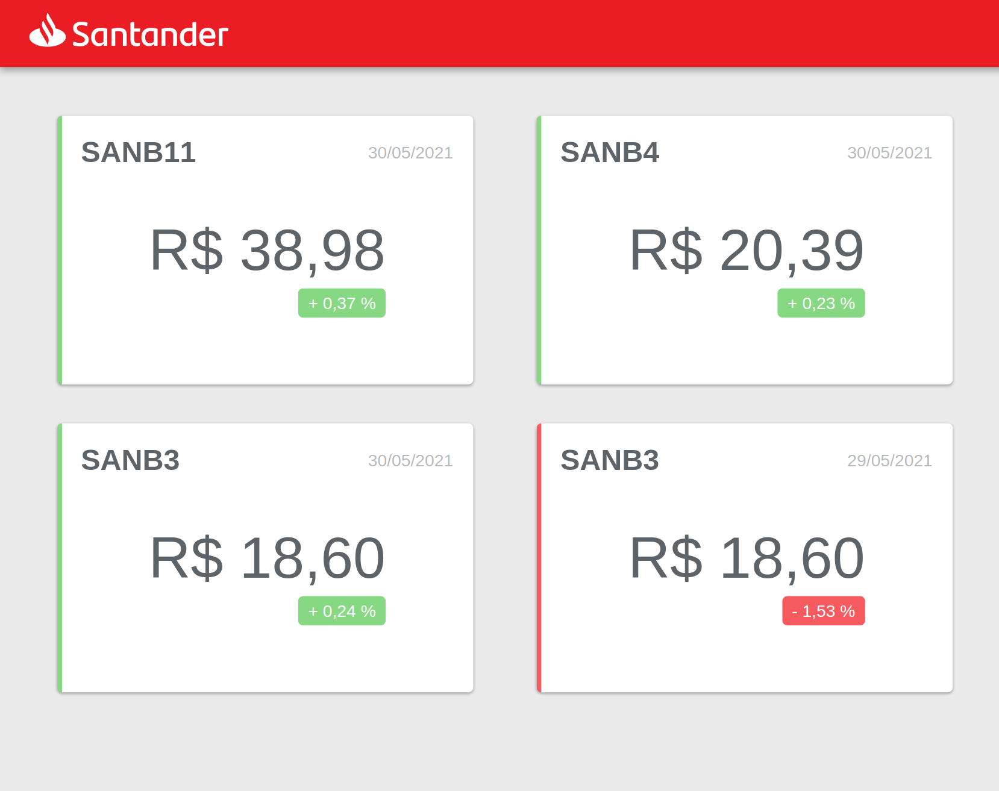

# Santander Dev Week Fullstack | Angular
## Projeto Home Broker
---
Projeto em Angular criado para o bootcamp DIO - Santander.

Veja o projeto **integrado** com o backend no link abaixo:
[homebroker](https://renoalencar.github.io/homebroker-frontend/)
---
## Mais informações
Esse Projeto foi gerado com [Angular CLI](https://github.com/angular/angular-cli) versão 12.0.1.

### Servidor de desenvolvimento
Inicie com `npm start`

Para abrir em modo de desenvolvimento acesse [http://localhost:4200/](http://localhost:4200/) no seu navegador.